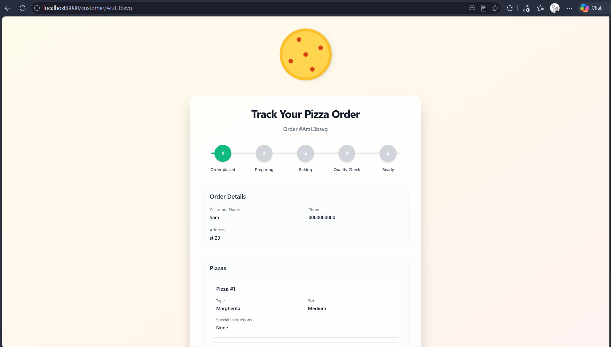
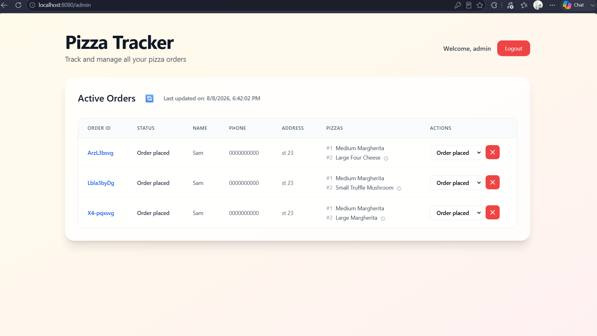
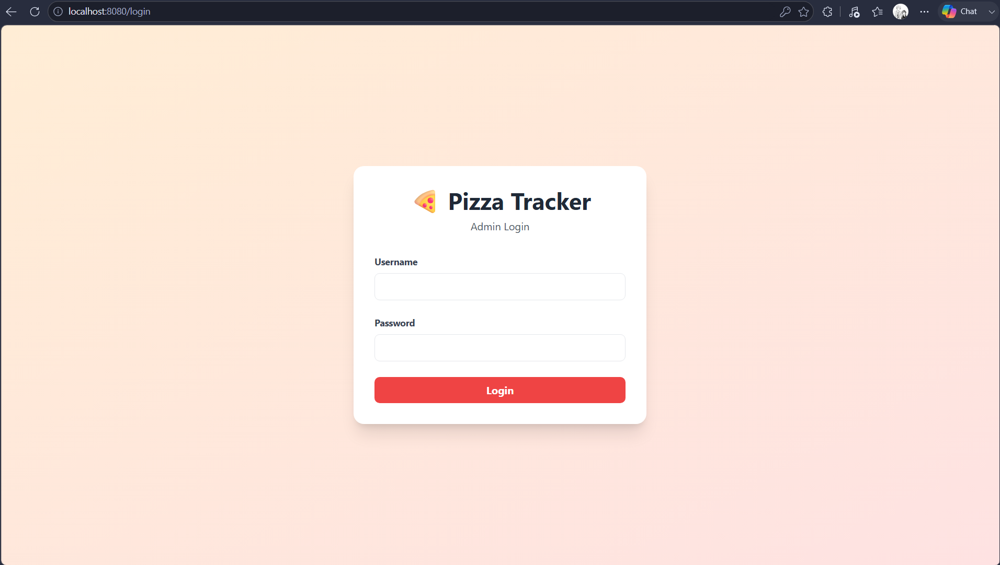
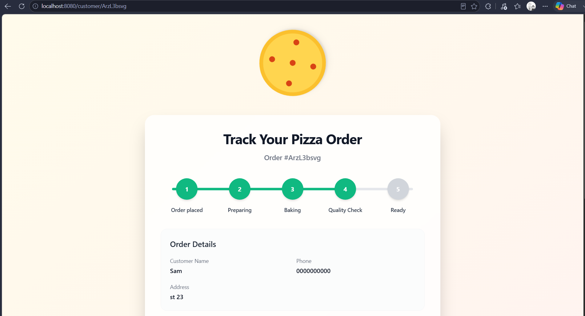

[](https://githubtree.mgks.dev/repo/sam-in07/piza_o_kudasai/saminnn/?ref=badge)

# piza_o_kudasai

A real-time pizza ordering and order-tracking web application built with **Golang, Gin, GORM, SQLite, and Server-Sent Events (SSE)**.

The project demonstrates backend development, database integration, authentication, server-side rendering, REST-style routing, and real-time browser updates using SSE.

## Features

* 🍕 Pizza order creation and tracking
* 🔐 User authentication with bcrypt password hashing
* 👤 Customer and admin functionality
* 📦 Order management with GORM
* ⚡ Real-time order status updates using Server-Sent Events (SSE)
* 🔔 Real-time notifications
* 🗄️ SQLite database integration
* ✅ Request validation
* 🧩 Middleware-based authentication
* 🎨 Server-rendered HTML templates
* 📱 Responsive UI using Tailwind CSS utility classes
* 🖼️ Order tracking and admin dashboard
* 📝 Project documentation and model notes

## Tech Stack

| Technology         | Purpose                             |
| ------------------ | ----------------------------------- |
| **Go**             | Backend programming language        |
| **Gin**            | HTTP web framework                  |
| **GORM**           | ORM and database operations         |
| **SQLite**         | Local relational database           |
| **SSE**            | Real-time server-to-client updates  |
| **bcrypt**         | Password hashing and authentication |
| **HTML Templates** | Server-side rendering               |
| **Tailwind CSS**   | UI styling                          |
| **Git/GitHub**     | Version control                     |

## Project Structure

```text
piza_o_kudasai/
│
├── cmd/
│   ├── notes/
│   │   └── validator.md
│   ├── admin.go
│   ├── customer.go
│   ├── events.go
│   ├── handlers.go
│   ├── main.go
│   ├── middleware.go
│   ├── notifications.go
│   ├── routes.go
│   ├── utils.go
│   └── validators.go
│
├── data/
│   ├── orders.bd
│   └── orders.db
│
├── internal/
│   ├── models/
│   │   ├── models.go
│   │   ├── order.go
│   │   └── user.go
│   │
│   └── notes/
│       ├── models.md
│       ├── order.md
│       ├── pgsql.md
│       └── user.md
│
├── readme_images/
│   ├── action_update.png
│   ├── admin_login.png
│   ├── customer_view.png
│   └── pizza_trackeer.png
│
├── templates/
│   ├── static/
│   │   ├── pizza-svgrepo-com.svg
│   │   └── pizza.svg
│   ├── admin.tmpl
│   ├── base.tmpl
│   ├── customer.tmpl
│   ├── login.tmpl
│   └── order.tmpl
│
├── go.mod
├── go.sum
├── Readme.md
└── readom.md
```

## Architecture

The application is organized into separate areas for routing, handlers, middleware, models, templates, and real-time event handling.

```text
                    Browser
                       │
                       ▼
                  Gin Router
                       │
          ┌────────────┼────────────┐
          ▼            ▼            ▼
      Customer       Admin       Middleware
      Handlers       Handlers    Authentication
          │            │
          └──────┬─────┘
                 ▼
              GORM
                 │
                 ▼
              SQLite
                 │
                 ▼
           Order Updates
                 │
                 ▼
                SSE
                 │
                 ▼
        Real-Time Browser Update
```

## Real-Time Updates

One of the main goals of this project is implementing real-time order tracking.

Instead of requiring the customer to repeatedly refresh the page, the server can push order status changes to connected clients using **Server-Sent Events (SSE)**.

The general flow is:

```text
Customer places order
        │
        ▼
Order saved with GORM
        │
        ▼
Admin updates order status
        │
        ▼
Server publishes event
        │
        ▼
SSE connection
        │
        ▼
Customer receives update
```

This provides a lightweight real-time communication mechanism while keeping the implementation server-driven.

## Authentication

User authentication is implemented using:

* Username/password authentication
* bcrypt password hashing
* GORM database queries
* Authentication middleware
* Protected admin/customer routes

Passwords are stored as bcrypt hashes rather than plaintext passwords.

Example authentication flow:

```text
Login Request
     │
     ▼
Find User
     │
     ▼
Compare Password
     │
     ├── Invalid → Authentication Error
     │
     └── Valid
          │
          ▼
      Authenticated User
```

## Main Routes

### Customer

| Method | Route           | Description        |
| ------ | --------------- | ------------------ |
| `GET`  | `/`             | Home/order page    |
| `POST` | `/new-order`    | Create a new order |
| `GET`  | `/customer/:id` | View order status  |
| `GET`  | `/login`        | Login page         |
| `POST` | `/login`        | Authenticate user  |

### Admin

The admin functionality provides order-management capabilities, including viewing orders and updating order status.

Typical administrative operations include:

| Method | Route        | Description                |
| ------ | ------------ | -------------------------- |
| `GET`  | `/admin`     | Admin dashboard            |
| `POST` | `/admin/...` | Admin order/status actions |

> Route details may vary depending on the current implementation in `cmd/routes.go`.

## Database

The application uses **SQLite** through GORM.

Main models include:

```text
User
 ├── ID
 ├── Username
 └── Password

Order
 ├── ID
 ├── Customer
 ├── Order information
 └── Status
```

The SQLite database is stored locally under:

```text
data/orders.db
```

For production deployments, a managed database such as PostgreSQL would be a suitable next step.

## Installation

### Requirements

Make sure you have:

* Go 1.20+ installed
* Git installed
* SQLite available if you want to inspect the database manually

### Clone the repository

```bash
git clone <repository-url>
cd piza_o_kudasai
```

### Install dependencies

```bash
go mod download
```

or:

```bash
go mod tidy
```

### Run the application

```bash
go run ./cmd
```

The application starts the Gin HTTP server on:

```text
http://localhost:8080
```

Open the application in your browser:

```text
http://localhost:8080
```

## Database Inspection

SQLite can be used to inspect the local database.

For example:

```bash
sqlite3 data/orders.db
```

Then:

```sql
SELECT * FROM users;
```

or:

```sql
SELECT * FROM orders;
```

## Screenshots

### Customer Order Page



### Pizza Order Tracking



### Admin Login



### Admin Order Update



## What I Learned

This project helped me develop practical experience with:

* Building web applications with Go
* Designing HTTP routes with Gin
* Working with relational databases using GORM
* Implementing authentication and password hashing
* Creating middleware for protected routes
* Rendering dynamic HTML templates
* Implementing real-time communication with SSE
* Managing application state and order workflows
* Structuring a Go project into maintainable packages
* Using Git and GitHub for version control

## Future Improvements

Potential improvements include:

* PostgreSQL support for production environments
* Docker containerization
* Automated unit and integration tests
* Improved frontend interactions
* Role-based authorization
* Production deployment
* Persistent event/message infrastructure
* CI/CD pipeline
* API documentation

## Author

**Samin**

Backend-focused Go developer interested in building reliable web applications, real-time systems, and database-driven services.

---

### Project Highlights

**Backend:** Go + Gin + GORM
**Database:** SQLite
**Authentication:** bcrypt
**Real-Time Communication:** Server-Sent Events (SSE)
**Frontend:** HTML Templates + Tailwind CSS
**Version Control:** Git + GitHub
